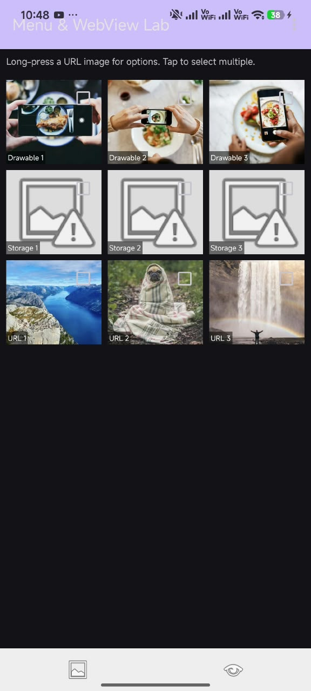

# Experiment 8 – Implementing Menus and WebView in Android Application

## Overview

This project demonstrates how to create an Android application that combines a **GridView**, all three types of Android menus (**Options Menu**, **Context Menu**, and **Popup Menu**), and a **WebView**. The application displays a 3x3 grid of images sourced from the app's drawable resources, phone storage, and a remote URL, and lets the user interact with them through menus.

## Concept & Technology

### GridView

`GridView` is used to display images in a scrollable, multi-column grid (3 columns x 3 rows).

### Options Menu

The **Options Menu** appears from the Toolbar's overflow and provides app-wide actions: `Home`, `Select All`, `Show`, and `Exit`.

### Context Menu

The **Context Menu** appears on a long press of a grid item and provides item-specific actions: `Edit`, `Save`, and `Delete`.

### Popup Menu

The **Popup Menu** appears automatically once more than one image is selected in the grid, docked above the bottom bar, with `Share Selected`, `Delete Selected`, and `Cancel Selection` options.

### WebView

`WebView` is used to load and display a web page inside the application itself, without switching to an external browser.

### Adaptive Image Loading

**Glide** is used to load images from three different sources through one consistent API:
- App `drawable` resources
- Phone storage (queried via `MediaStore`, with runtime permission handling)
- A remote image URL

### Components Used:

- **Kotlin:** Programming language for application logic.
- **XML Layouts:** Used to define the user interface.
- **GridView:** Displays the grid of images.
- **BaseAdapter:** Connects the image data with the GridView.
- **Toolbar / Options Menu:** App-level menu actions.
- **Context Menu:** Long-press item actions.
- **Popup Menu:** Multi-select actions.
- **WebView:** Displays a web page inside the app.
- **Glide:** Image loading library.
- **MediaStore:** Queries images from phone storage.

## Scenario

The application implements a menu-driven image gallery with an embedded browser:

1. The main screen contains a `GridView` with 9 images: 3 from `drawable`, 3 from phone storage, and 3 from a URL.
2. A custom `ImageAdapter` loads each image with Glide based on its source type.
3. Tapping an image selects it; selecting more than one image opens a `PopupMenu` above the bottom bar.
4. Long-pressing an image opens a `ContextMenu` with `Edit`, `Save`, and `Delete` options.
5. The Toolbar's overflow shows the `OptionsMenu` with `Home`, `Select All`, `Show`, and `Exit`.
6. The bottom bar's WebView icon opens a second screen that loads a web page inside a `WebView`.

## Folder and File Structure

```text
Exp81/
├── app/
│   ├── src/
│   │   ├── main/
│   │   │   ├── java/com/example/exp81/
│   │   │   │   ├── MainActivity.kt
│   │   │   │   ├── WebViewActivity.kt
│   │   │   │   ├── ImageAdapter.kt
│   │   │   │   └── ImageItem.kt
│   │   │   ├── res/
│   │   │   │   ├── layout/
│   │   │   │   │   ├── activity_main.xml
│   │   │   │   │   ├── activity_webview.xml
│   │   │   │   │   └── grid_item.xml
│   │   │   │   ├── menu/
│   │   │   │   │   ├── option_menu.xml
│   │   │   │   │   ├── context_menu.xml
│   │   │   │   │   └── popup_menu.xml
│   │   │   │   └── values/
│   │   │   │       ├── strings.xml
│   │   │   │       └── themes.xml
│   │   │   └── AndroidManifest.xml
│   │   └── build.gradle.kts
│   ├── build.gradle.kts
└── settings.gradle.kts

```

## Output




## Result

The Android application was successfully created using `GridView`, `ImageView`, and `WebView`. The application demonstrates all three Android menu types — Options Menu, Context Menu, and Popup Menu — while displaying images from drawable resources, phone storage, and a URL, and loading a web page through an in-app WebView.